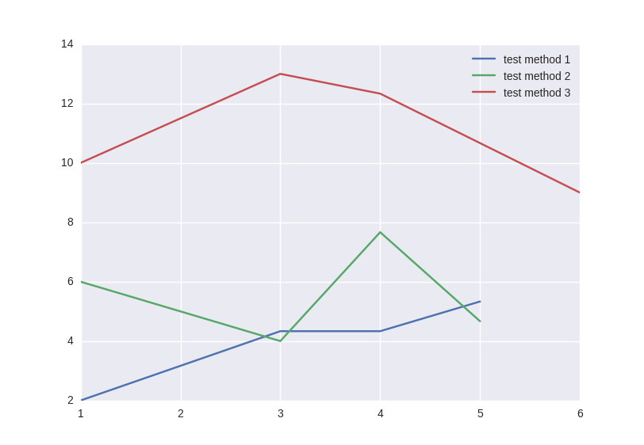
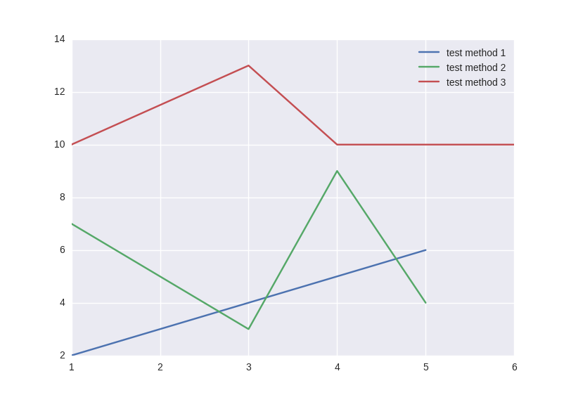
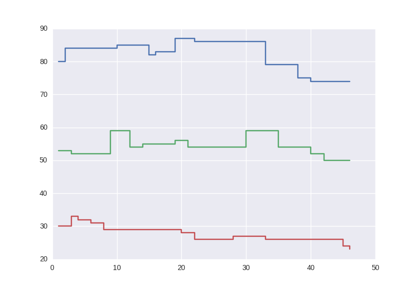
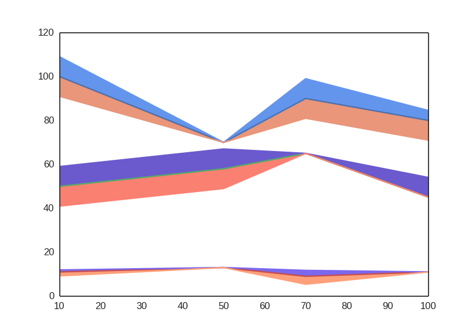

Visualizations
==============

.. _fmin:

Plots
-----
RoBO offers following plots pre-implemented in it's visualization package.

Mean
^^^^
Plots the mean of different runs of a method for a given time point.

.. code-block:: python

    #Example
    method_1 = np.array([[1,4,5,2], [3,4,3,6] , [2,5,5,8]])
    method_2 = np.array([[8,7,5,9], [7,3,9,1] , [3,2,9,4]])
    method_3 = np.array([[10,13,9,11], [9,12,10,10] , [11,14,18,6]])
    methods = [method_1, method_2, method_3]
    method_names = ['test method 1','test method 2','test method 3']
    plot = plot_mean(x,methods,method_names)
    plot.show()

Median
^^^^^^
Plots the median of different runs of a method for a given time point.

.. code-block:: python

    #Example
    x = np.array([[1, 3, 4, 5], [1, 3, 4, 5], [1, 3, 4, 6]])
    method_1 = np.array([[1,4,5,2], [3,4,3,6] , [2,5,5,8]])
    method_2 = np.array([[8,7,5,9], [7,3,9,1] , [3,2,9,4]])
    method_3 = np.array([[10,13,9,11], [9,12,10,10] , [11,14,18,6]])
    methods = [method_1, method_2, method_3]
    plot = plot_median(x,methods)
    plot.show()

Mean and Standard Deviation
^^^^^^^^^^^^^^^^^^^^^^^^^^^
**bar plot**
    Plots in a bar format.
    
**point plot**
    Plots with a point plot.

Standard Error of Mean
^^^^^^^^^^^^^^^^^^^^^^
**bar plot**
    Plots in a bar format.
    

**point plot**
    Plots with a point plot.

Plot Over Time
^^^^^^^^^^^^^^
Takes different runs of a method with different time points and interpolates each run so that all the runs have a value
at all the time points.

.. code-block:: python

    #Example
    method1 = np.array([[80,84,85,82,83, 87,86,86,79,75,74],[53,52,59,54,55,56,54,59,54,52,50],[30,33,32,31,29, 28,26,27,26,24,23]])
    time = np.array([[[1, 2, 10, 15,16, 19,22,27,33,38,40], [1, 3, 9, 12,14, 19,21,30,35,40,42], [1, 3, 4, 6, 8, 20,22,28,33,45,46]]])
    methods = [method1]
    plot = plot_over_time(time,methods,0.9)
    plot.show()

Median and Percentiles
^^^^^^^^^^^^^^^^^^^^^^
Plots the median and the percentiles of different runs of a method for a given time point.
By default plots the 5th and 95th percentile, if values not given.

.. code-block:: python

    #Example
    x = np.array([[10, 50, 70, 100 ], [10, 50, 70, 100], [10, 50, 70, 100]])
    method_1 = np.array([[100,70,90,80], [110,70,100,70] , [90,70,80,85]])
    method_2 = np.array([[50,58,65,45], [60,48,65,45] , [40,68,65,55]])
    method_3 = np.array([[9,13,12,11], [11,13,9,11] , [12,13,5,11]])
    methods = [method_1, method_2, method_3]
    plot = plot_median_and_percentiles(x,methods)
    plot.show()

